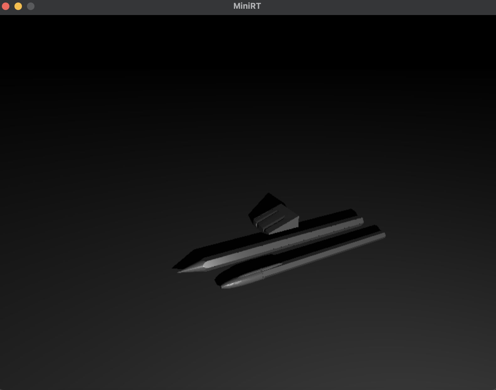
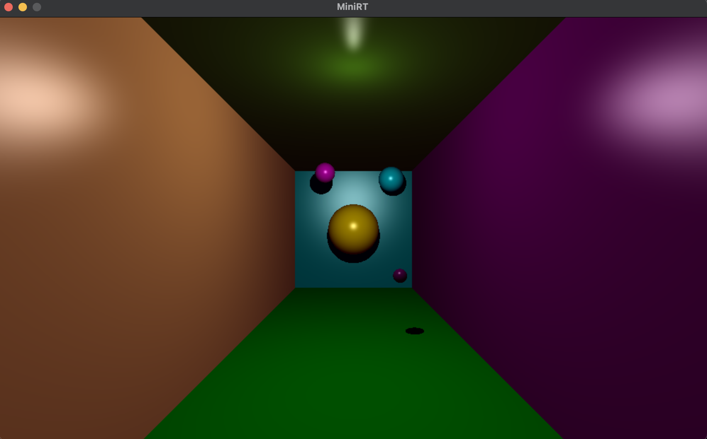
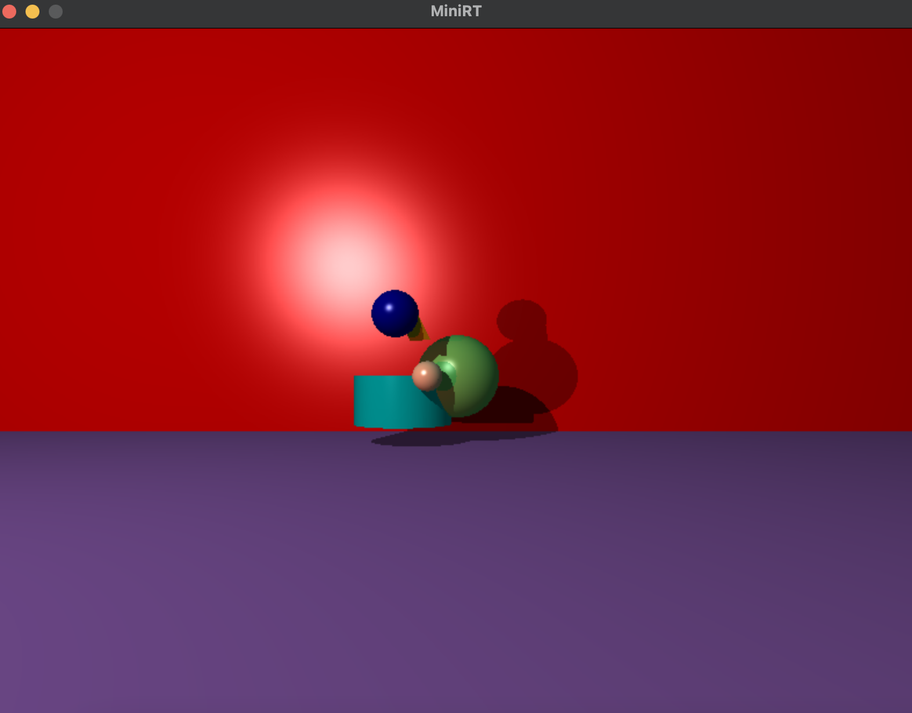

# MiniRT

This project is ray-tracing algorithm implementation.
You can install it this way (support MacOS only):
1. In command line "git clone https://github.com/toradziro/MiniRT"
2. Go in directory and run "make" to create an executable file
3. Run "./MiniRT srcs/ready_scenes/room.rt", you have to see this scene rendered

   
Keys allowed (depended of where camera looks):
1. "W" - go front
2. "S" - bo back
3. "A" - go left
4. "D" - go right
5. "Q" - go up
6. "E" - go down
7. "TAB" - to swich between to cameras

You can press left and right mouse key to resize a sphere (left make it bigger, right make it less)

Program reads an .rt file. It contais objects like:

// type, coordinates, color

1. sp - sphere
2. pl - plane
3. tr - triangle
4. cy - cylinder
5. sq - square
6. c - camera
7. l - light

For example take a look at all_figures.rt file, it generates scene like that

Where you can see all figures, lights, shadow management

Also this project using multithreading rendering (pthread library).
You can run project in save mode, for that you have to run it with "--save" flag
